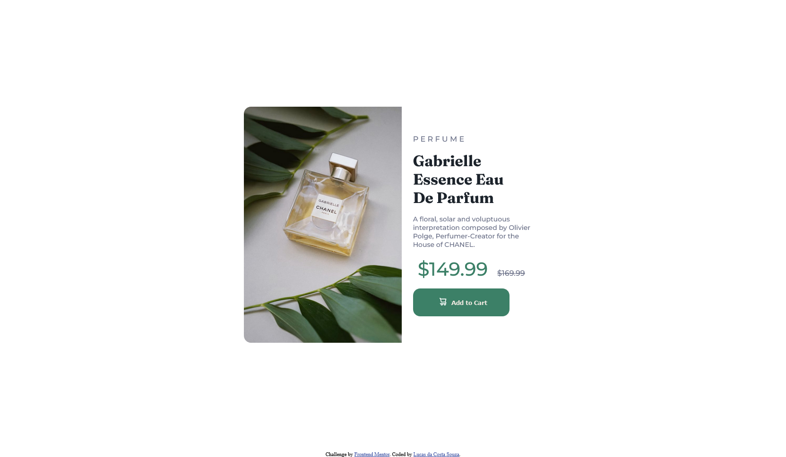

# Frontend Mentor - Product preview card component solution

This is a solution to the [Product preview card component challenge on Frontend Mentor](https://www.frontendmentor.io/challenges/product-preview-card-component-GO7UmttRfa). Frontend Mentor challenges help you improve your coding skills by building realistic projects.

## Table of contents

- [Overview](#overview)
  - [The challenge](#the-challenge)
  - [Screenshot](#screenshot)
- [My process](#my-process)
  - [Built with](#built-with)
  - [What I learned](#what-i-learned)
  - [Continued development](#continued-development)
  - [Useful resources](#useful-resources)
- [Author](#author)
- [Acknowledgments](#acknowledgments)

## Overview

### The challenge

Users should be able to:

- View the optimal layout depending on their device's screen size
- See hover and focus states for interactive elements

### Screenshot




## My process

### Built with

- Semantic HTML5 markup
- CSS custom properties
- Flexbox

### What I learned

I used this challenge to be able to review what I learned about HTML and CSS earlier in other programming courses.
In some parts of the code I had to learn how to replace one image with another using CSS as you can see:

```html
<div>
  
  
</div>
```

```css
.desktop-img {
  display: initial;
  border-top-left-radius: 15px;
  border-bottom-left-radius: 15px;
  width: 100%;
  height: 500px;
}

.mobile-img {
  display: none;
}

@media (max-width: 690px) {
  .mobile-img {
    display: initial;
    border-top-left-radius: 15px;
    border-top-right-radius: 15px;
    width: 100%;
    height: 245px;
  }

  .desktop-img {
    display: none;
  }
}
```

Using these codes, when the user uses a lower resolution,
the image that is being shown in the images div will be replaced by another one.

### Continued development

I will continue working on this project to improve the CSS code in it and add some features using JavaScript.

### Useful resources

- [Change image](https://stackoverflow.com/questions/43370666/how-to-image-swap-based-on-screen-size) - I liked the answer from user Dante delivered that uses mediaQuery
  to be able to change image in CSS

**Note: Delete this note and replace the list above with resources that helped you during the challenge. These could come in handy for anyone viewing your solution or for yourself when you look back on this project in the future.**

## Author

- Frontend Mentor - [@Lucas-C-Souza](https://www.frontendmentor.io/profile/Lucas-C-Souza)

## Acknowledgments
